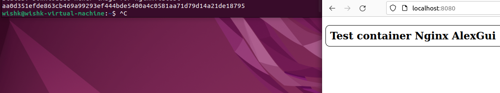
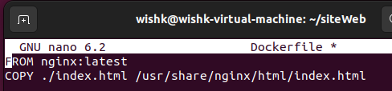

## TP1 Docker DevOps | Guillaume Saurin / Alexandre Ortuno
#### Les commandes sont en shell 
#### Le texte représente le retour des commandes 
2
```shell
docker run hello-world
docker run -it ubuntu bash
docker images
docker ps -a
docker run -p 80:80 nginx et docker run -p -d 80:80 nginx
```
// ICI mettre les screens retours de toutes les commandes 
5.a
```shell
docker pull nginx
````
```text
Using default tag: latest
latest: Pulling from library/nginx
025c56f98b67: Pull complete 
ca9c7f45d396: Pull complete 
ed6bd111fc08: Pull complete 
e25b13a5f70d: Pull complete 
9bbabac55ab6: Pull complete 
e5c9ba265ded: Pull complete 
Digest: sha256:ab589a3c466e347b1c0573be23356676df90cd7ce2dbf6ec332a5f0a8b5e59db
Status: Downloaded newer image for nginx:latest
docker.io/library/nginx:latest
```
5.b
```shell
docker image ls
````
```text
REPOSITORY    TAG       IMAGE ID       CREATED         SIZE
nginx         latest    ac8efec875ce   11 hours ago    142MB
hello-world   latest    feb5d9fea6a5   14 hours ago   13.3kB
```
5.c
```shell
echo > index.html
```
5.d
```shell
docker run -it --rm -d -p 8080:80 --name testPageNginx -v ~/siteWeb:/usr/share/nginx/html nginx
````
```text
aa0d351efde863cb469a99293ef444bde5400a4c0581aa71d79d14a21de18795
```
Cette commande nous permet de monter notre repository dans le container nginx.

Nous avons donc accès à notre fichier index.html depuis le container nginx.

5.e
```shell
sudo docker rm -f testPageNginx
docker run --name testPageNginx -d -p 8080:80 nginx
docker cp index.html testPageNginx:/usr/share/nginx/html
```

6.a
```shell
touch Dockerfile
nano DockerFile
````
Il contient :

```shell
docker build -t siteweb .
````
```text
Sending build context to Docker daemon  3.072kB
Step 1/2 : FROM nginx:latest
 ---> ac8efec875ce
Step 2/2 : COPY ./index.html /usr/share/nginx/html/index.html
 ---> 810848c356bc
Successfully built 810848c356bc
Successfully tagged siteweb:latest

```


6.b
```shell
docker run -it --rm -d -p 8080:80 --name testPageNginx2 siteweb
```

6.c
```text
Avec la méthode 5 nous avons un fichier index.html qui est dans le repository et qui est monté dans le container nginx.
Avec la méthode 6 nous avons un fichier index.html qui est dans le container nginx.

L'avantage de la méthode 5  est que nous pouvons modifier le fichier index.html sans avoir à rebuild le container.
L'avantage de la méthode 6  est que nous n'avons pas besoin de monter le repository dans le container. Elle me paraît plus rapide et plus simple.
```