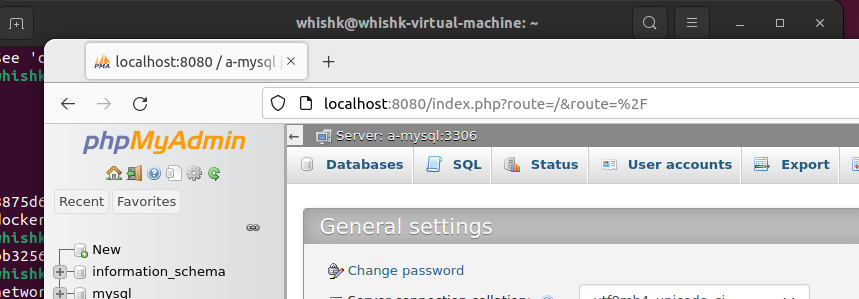
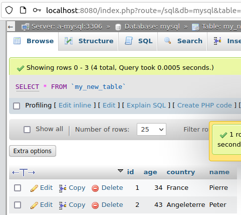

2
```shell
docker run hello-world
docker run -it ubuntu bash
docker images
docker ps -a
docker run -p 80:80 nginx et docker run -p -d 80:80 nginx
```

5.a
```shell
docker pull nginx
````
```text
Using default tag: latest
latest: Pulling from library/nginx
025c56f98b67: Pull complete 
ca9c7f45d396: Pull complete 
ed6bd111fc08: Pull complete 
e25b13a5f70d: Pull complete 
9bbabac55ab6: Pull complete 
e5c9ba265ded: Pull complete 
Digest: sha256:ab589a3c466e347b1c0573be23356676df90cd7ce2dbf6ec332a5f0a8b5e59db
Status: Downloaded newer image for nginx:latest
docker.io/library/nginx:latest
```
5.b
```shell
docker image ls
````
```text
REPOSITORY    TAG       IMAGE ID       CREATED         SIZE
nginx         latest    ac8efec875ce   11 hours ago    142MB
hello-world   latest    feb5d9fea6a5   14 hours ago   13.3kB
```
5.c
```shell
echo > index.html
```
5.d
```shell
docker run -it --rm -d -p 8080:80 --name testPageNginx -v ~/siteWeb:/usr/share/nginx/html nginx
````
```text
aa0d351efde863cb469a99293ef444bde5400a4c0581aa71d79d14a21de18795
```
Cette commande nous permet de monter notre repository dans le container nginx.

Nous avons donc accès à notre fichier index.html depuis le container nginx.

5.e
```shell
docker rm -f testPageNginx
docker run --name testPageNginx -d -p 8080:80 nginx
docker cp index.html testPageNginx:/usr/share/nginx/html
```

6.a
```shell
touch Dockerfile
nano DockerFile
````
Il contient :

```shell
docker build -t siteweb .
````
```text
Sending build context to Docker daemon  3.072kB
Step 1/2 : FROM nginx:latest
 ---> ac8efec875ce
Step 2/2 : COPY ./index.html /usr/share/nginx/html/index.html
 ---> 810848c356bc
Successfully built 810848c356bc
Successfully tagged siteweb:latest

```


6.b
```shell
docker run -it --rm -d -p 8080:80 --name testPageNginx2 siteweb
```

6.c
```text
Avec la méthode 5 nous avons un fichier index.html qui est dans le repository et qui est monté dans le container nginx.
Avec la méthode 6 nous avons un fichier index.html qui est dans le container nginx.

L'avantage de la méthode 5  est que nous pouvons modifier le fichier index.html sans avoir à rebuild le container.
L'avantage de la méthode 6  est que nous n'avons pas besoin de monter le repository dans le container. Elle me paraît plus rapide et plus simple.
```
7.a
```shell
docker pull mysql:5.7
```
```text
latest: Pulling from library/mysql
0ed027b72ddc: Pull complete 
0296159747f1: Pull complete 
3d2f9b664bd3: Pull complete 
df6519f81c26: Pull complete 
36bb5e56d458: Pull complete 
054e8fde88d0: Pull complete 
f2b494c50c7f: Pull complete 
132bc0d471b8: Pull complete 
135ec7033a05: Pull complete 
5961f0272472: Pull complete 
75b5f7a3d3a4: Pull complete 
Digest: sha256:3d7ae561cf6095f6aca8eb7830e1d14734227b1fb4748092f2be2cfbccf7d614
Status: Downloaded newer image for mysql:latest
docker.io/library/mysql:latest
```
```shell
docker pull phpmyadmin/phpmyadmin
```
```text
Using default tag: latest
latest: Pulling from phpmyadmin/phpmyadmin
214ca5fb9032: Pull complete 
cd813a1b2cb8: Pull complete 
63cf7574573d: Pull complete 
54c27146d16e: Pull complete 
078f4450f949: Pull complete 
...
Digest: sha256:ae6dadd9cf3c158e42937788f7255fa820ea3daef0349226d8d43f32e76535e1
Status: Downloaded newer image for phpmyadmin/phpmyadmin:latest
docker.io/phpmyadmin/phpmyadmin:latest
```
7.b
<br><br>
On créer d'abord un network que nos 2 containers partagerons

```shell
docker network create mysql-network
```
```text
e59e28be4a3499f6203fcc3eeef1c79f1900daf87639197a45c303b1e395a576
```
On run ensuite notre container Mysql et on lui spécifie le path du network que nous venons de créer
```shell
docker run --name a-mysql \
           --net=mysql-network \
           -p 3306:3306 \
           -e MYSQL_ROOT_PASSWORD=password \
           -v dbdata:/var/lib/mysql \
           -d mysql:5.7  > /dev/null
```
```text
ba8a3c7c8e599b61e2254fbf824aef8f4c53366db03c8f27ca662ab3b5a7bc17
```
On run ensuite notre container phpmyadmin et on lui spécifie le path du network que nous venons de créer
```shell
docker run --name a-mysql-admin \
           --net=mysql-network \
           -e MYSQL_ROOT_PASSWORD=password \
           -e PMA_HOST="a-mysql" \
           -e PMA_PORT=3306 \
           -p 8080:80 \
           -d phpmyadmin/phpmyadmin
```
On accède ensuite à notre interface phpmyadmin via le port 8080

On peut maintenant ajouter une table et des données comme ici dans notre nouvelle table regroupant des profils d'user 


<br><br>
8
On utilise le fichier suivant : 
````text
version: '3'
 
services:
  db:
    image: mysql:5.7
    container_name: dbFromYaml
    environment:
      MYSQL_ROOT_PASSWORD: password
      MYSQL_DATABASE: app_db
      MYSQL_USER: db_user
      MYSQL_PASSWORD: user_password
    volumes:
      - dbdata:/var/lib/mysql
  phpmyadmin:
    image: phpmyadmin/phpmyadmin
    container_name: pmaFromYaml
    links:
      - db
    environment:
      PMA_HOST: db
      PMA_PORT: 3306
      PMA_ARBITRARY: 1
    restart: always
    ports:
      - 8080:80
volumes:
  dbdata:
````
```shell
docker compose up -d
```
```text
[+] Running 4/4
 ⠿ Network whishk_default  Created                                                                              0.5s
 ⠿ Volume "whishk_dbdata"  Created                                                                              0.0s
 ⠿ Container dbFromYaml    Started                                                                              7.0s
 ⠿ Container pmaFromYaml   Started                                                                            6.9s
```
8.a
````text
Le docker-compsoe nous permet de créer plusieurs containers en même temps.
Il est intéressant car il permet de créer des containers qui communiquent entre eux sans faire des commandes 'docker run' à rallonge.
Lorsque l'on travail à plusieurs sur un projet, il est plus simple de partager un fichier docker-compose.yml que de partager des commandes docker run.
````
8.b
````text
Le fichier docker-compose.yml.
On peut y spécifier le nom du container, le port, le mot de passe, le nom de la base de donnée, le nom de l'user, le mot de passe de l'user, le path du volume.
Comme vu dans notre précedent script.
````

9.a
````shell
docker pull praqma/network-multitool
````
````text
Using default tag: latest
latest: Pulling from praqma/network-multitool
5758d4e389a3: Pull complete 
89d2c42e021e: Pull complete 
c56ef2f6b498: Pull complete 
fb4370a69dda: Pull complete 
003f3d74368c: Pull complete 
cd3def2cca55: Pull complete 
ba5a2b2d204e: Pull complete 
Digest: sha256:97b15098bb72df10f7c4e177b9c0e2435ec459f16e79ab7ae2ed3f1eb0e79d19
Status: Downloaded newer image for praqma/network-multitool:latest
docker.io/praqma/network-multitool:latest
````
On créer 3 services et 2 network. 
grâce à l'option external_links, on peut faire communiquer nos 2 containers grâce aux alias.
Sans qu'ils puissent se ping car ils ne sont pas dans le même network.
````text

````text
version: "3"
services:
  web:
    image: praqma/network-multitool
    networks:
      - frontend
    external_links:
      - db:db-alias
  app:
    image: praqma/network-multitool
    networks:
      - backend
  db:
    image: praqma/network-multitool
    networks:
      - backend
    external_links:
      - web:web-alias
networks:
  frontend:
  backend:
````
````shell
docker-compose up -d
````

9.b
````shell
docker inspect d3084cc99ea0 | grep -A 15 Networks
````
````text
Service DB
 "Networks": {
                "whishk_backend": {
                    "IPAMConfig": null,
                    "Links": [
                        "web:web-alias"
                    ],
                    "Aliases": [
                        "whishk-db-1",
                        "db",
                        "f5a089f07a28"
                    ],
                    "NetworkID": "9e625fa59399be89acd1a158d5c166ab335360e201287d166a2bea46d52ebda0",
                    "EndpointID": "03f44c1293206768b0e1d990a5e2a8c0c0b9d7d5a1e9e56f58d126c00c36d836",
                    "Gateway": "172.21.0.1",
                    "IPAddress": "172.21.0.2",
                    "IPPrefixLen": 16,

Service Web
 "Networks": {
                "whishk_frontend": {
                    "IPAMConfig": null,
                    "Links": [
                        "db:db-alias"
                    ],
                    "Aliases": [
                        "whishk-web-1",
                        "web",
                        "d3084cc99ea0"
                    ],
                    "NetworkID": "a79d69dc921a8500278a2687241b8a7371e9a46f30b6a94806095aa1407335fb",
                    "EndpointID": "8c0d58e85e1bd655bba28836713b671e62b83fb5848725c672c7b0a77d9c1bf6",
                    "Gateway": "172.20.0.1",
                    "IPAddress": "172.20.0.2",
                    "IPPrefixLen": 16,
````
````text
Ces lignes nous montrent que les 2 services n'appartiennet pas au même network.
Ils ne peuvent donc pas se ping.
````

9.c
````text
On pourrait avoir ce genre de configuration avec par exemple une image Wordpress, une image MySQL et une image PhpMyAdmin.
Avec un container pour le front et un container pour le back. 
Cela nous permettrait de séparer les services, mais de les faire communiquer entre eux.
````

